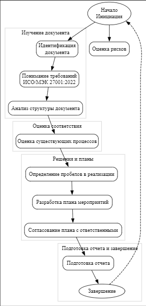

## Сертификация ИСО (Международная организация по стандартизации) 

представляет собой процесс подтверждения, проводимый органом по сертификации, чтобы убедиться в том, что организация соответствует определенному стандарту ИСО. ИСО разрабатывает и утверждает международные стандарты в различных областях, и эти стандарты часто применяются для обеспечения качества, безопасности и эффективности в различных отраслях и секторах.

## Вот несколько ключевых аспектов сертификации ИСО:

Что это такое?
Международные стандарты:

ИСО разрабатывает стандарты в различных областях, таких как качество продукции, управление информацией, экологическая устойчивость и др.
Сертификация:

Сертификация ИСО представляет собой процесс, в результате которого организация подтверждает соответствие ее системы управления стандартам ИСО.
Как используется?
## Улучшение качества:

Организации стремятся к сертификации ИСО для улучшения качества продукции или услуг, что в свою очередь способствует повышению доверия клиентов.
## Мировое признание:

Сертификация ИСО обеспечивает мировое признание, что может быть важным при ведении бизнеса на международном уровне.
## Соблюдение законодательства:

В некоторых отраслях сертификация ИСО может быть обязательной для соблюдения законодательства.
## Улучшение эффективности:

Многие стандарты ИСО направлены на улучшение эффективности управления бизнес-процессами.
Цели и задачи:
## Обеспечение качества:

Цель - обеспечить высокий стандарт качества продукции или услуг.
## Управление рисками:

Задача - помочь организации эффективно управлять рисками и обеспечивать надежность бизнес-процессов.
## Мировое признание:

Цель - получить признание на мировом уровне и повысить конкурентоспособность.
## Улучшение управления:

Задача - улучшить системы управления организацией.
## Соблюдение требований:

Цель - обеспечить соответствие требованиям законодательства и нормативам.
Сертификация ИСО может быть применена в различных областях, таких как управление качеством (например, ISO 9001), управление информацией и безопасностью (например, ISO 27001), экологическое управление (например, ISO 14001) и другие.

 